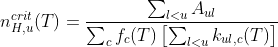

# MeudonPDR-critical-density

Computes and plots the critical density of a chemical species in a range of temperatures

# Introduction

This repo contains an interactive notebook for computing and plotting the critical density of some species in function of the temperature. The computation is done 

* with no simplifications (in particular, we don't use a two-level approximation) 

* with a set of colliders

The computation is done with the following general formula :



where
* the A coefficients are the Einstein de-excitation rates. Those values are stored in the files of the `./data/Lines/` folder. For these coefficients, there is only one file per species.

* The k coefficients are collisional de-excitation rates. These values are stored in the files of the `./data/Collisions/` folder. For these coefficients, there is one file per pair (species, collider). 

* the f coefficients are abundances of the colliders. They define the medium in which the critical density is computed (molecular or atomic). These values are stored in the `.data/abundance_colliders.csv` file. 

Note : 
* the effect of optical depth is not taken into account.

* The files of the `Lines` and `Collisions` folders follow the standards of the Meudon PDR code. I left a few files to give examples of use. You can use your own files as long as they are structured the same way.

# Installation

Simply clone this repository and run 

```shell
git clone <insert key>
cd MeudonPDR-critical-density
conda env create -f environment.yml
conda activate critical_densities_env
```

and run the notebook. 

Note : If you don't use conda, make sure you have glob, pandas, numpy, matplotlib and ipywidgets installed.


# Usage

To use, in the 2nd cell, enter the name different names the chemical species you want have (ex : for CO, it is called co in `Lines` and 12c16o in `Collisions`, while C+ is called cp in both folders). Then run the whole notebook.
